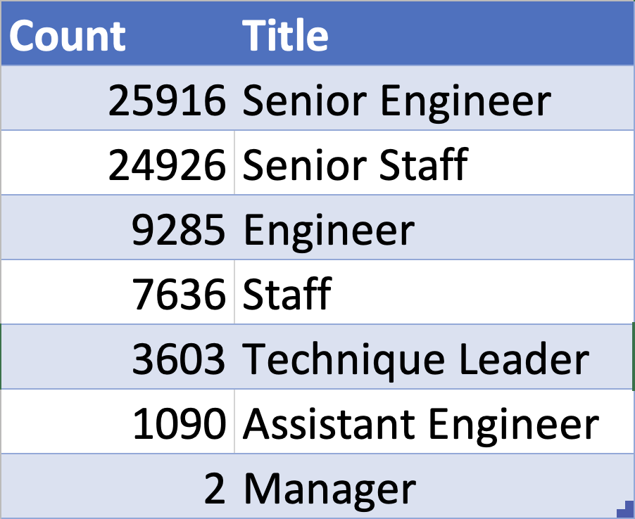
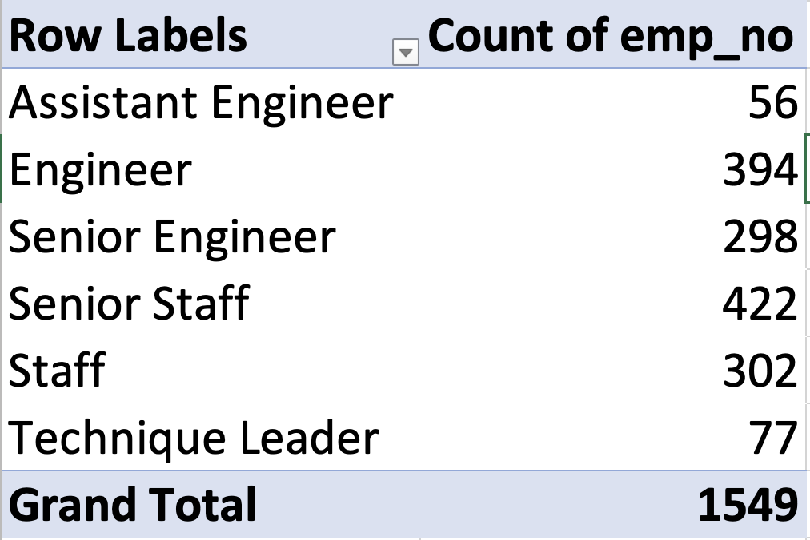

# Pewlett Hackard Analysis
### Overview
The purpose of this analysis was to assist the company, Pewlett Hackard, in assessing their preparedness (from a staffing perspective) for their inevitable "silver tsunami." This company is facing a large number of employees and managers reaching their retirement eligibility within the next few years and is attempting to forecast the number of employees they will need to hire and develop in order to replace those retiring.

In order to assess their preparedness, we created an analysis determining the number of employees retiring within the next few years, their titles, and the number retiring with each title. We also wanted to analyze if the company currently has the correct number of senior-level staff in place to train and develop younger/newer employees to fill the shoes of those retiring.

### Results
* The company can expect to lose 72,458 employees to retirement over the next few years. This can be seen in the Unique Titles spreadsheet [here.](Pewlett_Hackard_Analysis_Challenge/Data/unique_titles.csv)
* Of these retiring employees, the majority of them are in senior level positions. The breakdown by their current title is shown below:

* The company is losing a large number of employees and the number of employees in the qualifying age-range to serve as mentors to younger employees is small - 1,549 employees meet the criteria to serve as mentors.
* The breakdown of titles for employees who would be able to serve as mentors is shown below:

### Summary
When considering the huge difference in total employees becoming eligible for retirement and the relatively small number of qualified mentors, Pewlett Hackard is certainly met with a challenging situation.

* Over the course of the next few years, upwards of 70,000 employees must be ready to fill the shoes of those who are retiring, with over half of the positions vacated being senior level positions.
* The company's current age expectation for employees to qualify as mentors means that just over 1,500 employees qualify to mentor others. In order for only this group to mentor all of the employees required to fill the places of those retiring, each mentor would have to train almost 47 mentees in the next few years.
##### Further Research
* In order to find a larger group of qualified mentors, the company should consider an employee's length of time in their current position vs. simply their age. A younger employee who has been an engineer for 5 years would not have come up in the original analysis because age was the only factor being used to consider a mentor's eligibility. A new analysis considering years of experience as a variable may result in a larger pool of mentors.
* Additionally, an additional analysis should be run to determine, more specifically, the years the employees who are slated for retirement are likely to retire. This analysis should be grouped by title as well so that the company can prepare for the impact of the "silver tsunami" more specifically - addressing whether specific departments will be hit more heavily during certain years.
